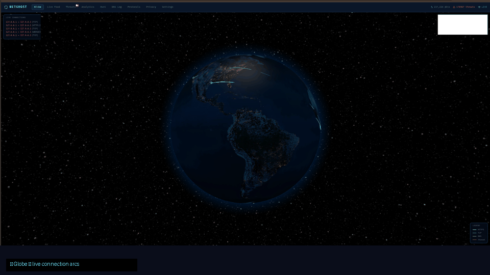

<p align="center">
  
</p>

<h1 align="center">👻 NetGhost</h1>

<p align="center">
  <strong>Personal network traffic visualizer & threat detector for Linux</strong><br/>
  Real-time 3D globe · Live packet capture · DNS tracking · Privacy audit
</p>

<p align="center">
  
  
  
  
  
  
</p>

<p align="center">
  
  
  
  
  
  
</p>

---

## What is it?

NetGhost is a self-hosted network monitoring dashboard that runs entirely on your local machine. It captures every packet leaving or entering your system, plots the connections on a live 3D globe, flags suspicious activity, and gives you a searchable log of everything — including which apps are phoning home.

No cloud. No agents. No subscriptions. Just a FastAPI backend, a React frontend, and tshark.

---

## Features

| | Feature | Detail |
|---|---|---|
| 🌍 | **3D Globe** | Real-time arcs from your machine to destination IPs. Color-coded by protocol. Rotates live. |
| 📡 | **Live Packet Feed** | Every packet streamed via WebSocket. Filter by IP, protocol, country, or threat type. |
| ⚠️ | **Threat Detection** | Flags suspicious ports, C2 beaconing indicators, port scans, large outbound transfers. |
| 📊 | **Analytics** | 1-hour connection timeline, protocol pie chart, top destination countries and IPs. |
| 🔍 | **Hunt** | Free-text search across all traffic — IP, country code, protocol, port, DNS query, threat type. |
| 🌐 | **DNS Log** | Every DNS query logged. Trackers, ad networks, and telemetry endpoints highlighted. |
| 🖥️ | **Protocols** | Bandwidth and connection count grouped by protocol with click-through destination detail. |
| 🔒 | **Privacy Audit** | Privacy score (0–100) with per-app tracker breakdown and actionable block recommendations. |
| ⚙️ | **Settings** | Database stats, one-click data clear, live capture status, quick-reference command list. |

---

## Screenshots

<details>
<summary><b>Live Feed — real-time packet stream</b></summary>
<br/>

Every packet as it arrives. Filter by protocol, search by IP or country, click any row for connection detail.

</details>

<details>
<summary><b>Threat Detection — zero false positives</b></summary>
<br/>

Flags genuinely suspicious ports (Metasploit 4444, Back Orifice 31337, NetBus, IRC botnets) and port scans using a time-windowed service-port counter. Filters out ephemeral client ports so reply packets never trigger false alerts.

</details>

<details>
<summary><b>DNS Log & Privacy Audit</b></summary>
<br/>

Captures every DNS query and cross-references against a list of 30+ known tracker, ad network, and telemetry domains. Scores your session 0–100 and recommends specific `/etc/hosts` blocks or browser extension settings.

</details>

---

## Architecture

```
NetGhost/
├── backend/
│   ├── main.py            # FastAPI app — all REST routes, WebSocket, capture loop
│   ├── capture.py         # tshark subprocess capture → auto-fallback to demo mode
│   ├── threat_engine.py   # Threat scoring: bad ports, port scan, exfil heuristics
│   ├── geoip_service.py   # MaxMind GeoLite2 mmdb + country-coordinate fallback
│   ├── database.py        # aiosqlite schema + WAL mode + auto-migrations
│   └── requirements.txt
├── frontend/
│   └── src/
│       ├── components/    # Globe3D, Analytics, DNSLog, PrivacyAudit, Hunt, ...
│       ├── hooks/         # useWebSocket — exponential backoff reconnect
│       ├── store.ts       # Zustand global state (connections, threats, status)
│       └── types.ts       # Shared TypeScript interfaces
└── start.sh               # One-shot launcher for both services
```

**Backend** — FastAPI + uvicorn on `:8000`. Single async loop reads tshark output, resolves GeoIP, scores threats, writes to SQLite, and broadcasts to all connected WebSocket clients simultaneously.

**Frontend** — Vite + React 19 on `:5173`. Vite dev proxy forwards `/api` and `/ws` to the backend. State is kept in a Zustand store capped at 500 connections and 100 threats to prevent memory growth.

**Capture** — tshark is invoked as a subprocess with `-T ek` (Elastic JSON) output. Parsed fields include src/dst IP, ports, frame length, timestamp, DNS query name, and DNS response. Falls back to a realistic demo traffic generator if tshark is unavailable or lacks capture permission.

---

## Quick Start

### Prerequisites

```bash
# tshark (optional — for live capture; demo mode works without it)
sudo apt install tshark -y

# Allow capture without sudo (Kali/Debian/Ubuntu)
sudo usermod -aG wireshark $USER && newgrp wireshark

# Python 3.11+ and Node 18+
python3 --version
node --version
```

### Install

```bash
git clone https://github.com/zhnverse/NetGhost.git
cd NetGhost

# Backend — create virtualenv and install deps
cd backend
python3 -m venv venv
source venv/bin/activate
pip install -r requirements.txt
cd ..

# Frontend — install npm packages
cd frontend && npm install && cd ..
```

### Run

```bash
./start.sh
```

Open **http://localhost:5173**

> **No tshark / no root?** NetGhost auto-starts in **demo mode** — generating realistic simulated traffic complete with geo data, DNS queries, tracker hits, and occasional suspicious connections. Every feature works without any capture permission.

---

## Threat Detection

NetGhost flags connections based on three signals:

### 1. Suspicious destination ports
Outbound connections to known-bad ports trigger an alert:

| Port | Threat Type | Severity |
|------|-------------|----------|
| 4444 | Reverse shell (Metasploit default) | 🔴 High |
| 31337 | Back Orifice / elite backdoor | 🔴 High |
| 6666–6669 | IRC botnet C2 | 🔴 High |
| 12345 | NetBus RAT | 🔴 High |
| 27374 | Sub7 trojan | 🔴 High |
| 1337 | Generic C2 indicator | 🟡 Medium |
| 4899 | Radmin remote admin | 🟡 Medium |
| 1080 | SOCKS proxy (malware pivot) | 🟡 Medium |
| 9001/9030 | Tor relay/directory | 🟢 Low |

### 2. Port scan detection
Tracks unique **service ports** (< 1024) contacted per src→dst pair within a 60-second sliding window. Raises an alert at ≥ 15 unique ports. Ephemeral client ports (32768+) are intentionally excluded — otherwise every TCP reply packet would trigger a false positive.

### 3. Large outbound transfers
Connections sending > 10 MB to a non-LAN destination are flagged as potential data exfiltration.

---

## Privacy Audit

NetGhost classifies DNS queries against 30+ known domains:

| Category | Examples |
|----------|---------|
| **Trackers** | google-analytics.com, googletagmanager.com, hotjar.com, segment.com |
| **Ads** | doubleclick.net, googlesyndication.com, amazon-adsystem.com, criteo.com |
| **Telemetry** | telemetry.microsoft.com, vortex.data.microsoft.com, browser.events.data.microsoft.com |
| **Analytics** | mixpanel.com, amplitude.com, fullstory.com, heap.io |

The privacy score starts at 100 and deducts points for tracker traffic ratio, number of distinct trackers, telemetry endpoints, and ad networks. Recommendations are generated per-domain with specific actionable steps.

---

## Hunt Query Examples

The Hunt tab does full-text search across all captured fields:

```
8.8.8.8              → all connections to/from Google DNS
104.18               → all Cloudflare IP range traffic
CN                   → connections to China
DNS                  → DNS protocol only
4444                 → Metasploit port
reverse_shell        → detected reverse shell indicators
port_scan            → detected port scans
google-analytics     → GA tracker DNS hits
downloads.claude.ai  → specific domain in DNS log
```

---

## API Reference

The backend exposes a full REST API at `http://localhost:8000`. Interactive docs at **http://localhost:8000/docs**.

| Method | Endpoint | Description |
|--------|----------|-------------|
| `GET` | `/api/status` | Live stats: connections, threats, bytes in/out, WS clients |
| `GET` | `/api/connections` | Paginated connection log with filters |
| `GET` | `/api/threats` | Threat events with severity |
| `GET` | `/api/hunt?q=` | Full-text search across all fields |
| `GET` | `/api/dns` | DNS query log with tracker classification |
| `GET` | `/api/dns/stats` | DNS summary: queries/hr, tracker count, unique domains |
| `GET` | `/api/processes` | Protocol-grouped network stats |
| `GET` | `/api/processes/{name}` | Per-protocol detail with top IPs and countries |
| `GET` | `/api/privacy` | Privacy score + tracker/ad/telemetry breakdown |
| `GET` | `/api/settings` | DB size, row counts, capture mode |
| `GET` | `/api/stats/geo` | Top destination countries |
| `GET` | `/api/stats/timeline` | Connections per minute (last N minutes) |
| `GET` | `/api/stats/protocols` | Packet count + bytes per protocol |
| `GET` | `/api/stats/top_ips` | Top destination IPs by connection count |
| `GET` | `/api/threat_intel` | Manual threat intelligence entries |
| `POST` | `/api/threat_intel/add` | Add IP to threat intel database |
| `DELETE` | `/api/connections/clear` | Wipe all connections, threats, and DNS log |
| `WS` | `/ws` | Live connection stream (sends last 50 on connect) |

---

## Tech Stack

| Component | Technology |
|-----------|-----------|
| Backend API | [FastAPI](https://fastapi.tiangolo.com/) + [uvicorn](https://www.uvicorn.org/) |
| Database | [SQLite](https://www.sqlite.org/) via [aiosqlite](https://github.com/omnilib/aiosqlite) (WAL mode) |
| Packet Capture | [tshark](https://www.wireshark.org/docs/man-pages/tshark.html) (Wireshark CLI) |
| GeoIP | [MaxMind GeoLite2](https://dev.maxmind.com/geoip/geolite2-free-geolocation-data) (auto-detected on system) |
| Frontend Framework | [React 19](https://react.dev/) + [Vite 8](https://vitejs.dev/) + TypeScript |
| 3D Globe | [globe.gl](https://globe.gl/) |
| Charts | [Recharts](https://recharts.org/) |
| State Management | [Zustand](https://github.com/pmndrs/zustand) |
| Icons | [Lucide React](https://lucide.dev/) |
| Real-time | WebSocket (native browser API + FastAPI WebSocket) |

---

## Requirements

- **OS:** Linux (tested on Kali Linux; works on any Debian/Ubuntu derivative)
- **Python:** 3.11+
- **Node.js:** 18+
- **tshark:** Optional (demo mode available without it)
- **GeoIP:** MaxMind GeoLite2 database (auto-detected from common system paths; coordinate fallback built in)

---

## License

MIT — do whatever you want with it.
